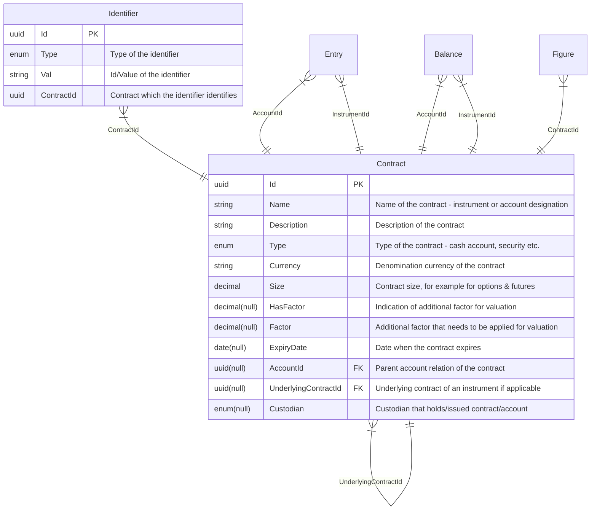
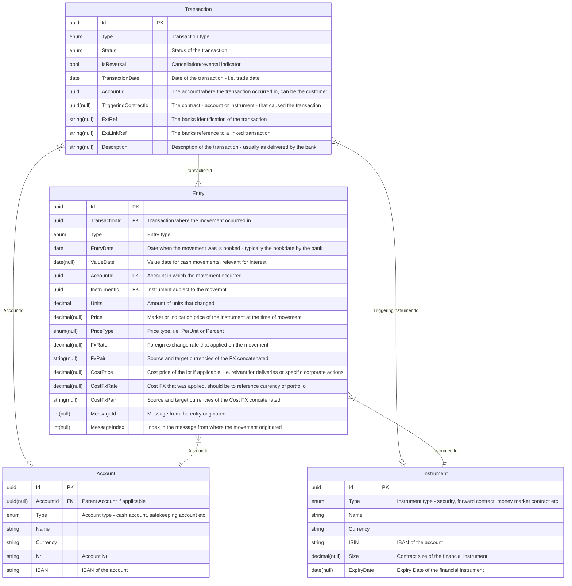
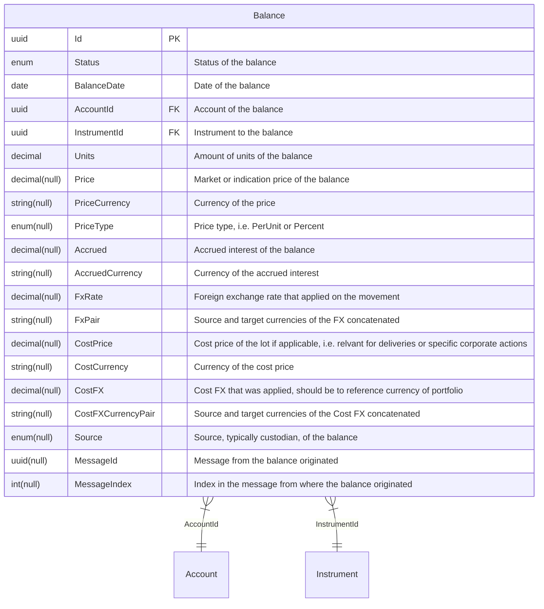
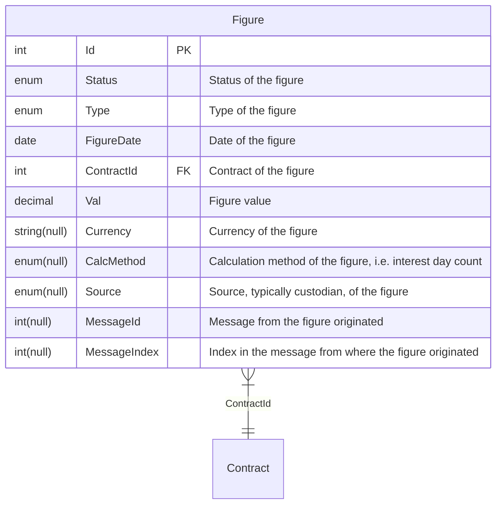
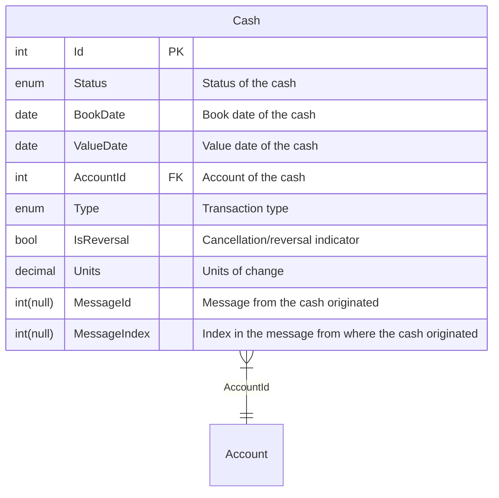

# Documentation of entities and their relationships

## Entity relationships of a contract

### Contract

A contract is a identifiable value bearing object to which a price can be associated. Contracts are grouped in two main categories:
- accounts
- (financial) instruments

#### Account

An account is an entity that describes a basket/container of financial instruments. Each account must be associated to a customer (typically the account holder and beneficial owner) and is usually enclosed in a portfolio. An account must by identified by a unique reference, the account number. It should also have an [IBAN](https://en.wikipedia.org/wiki/International_Bank_Account_Number) - International Bank Account Number - associated to it. There mainly two types of accounts:

- Customer Account
- Portfolio Account
- Cash Account
- Safekeeping Account

The cash account is as commonly understood a container for holdings of a currency. In this case the currency can be looked at as the financial instrument identified by its ISO3 currency code. In the case of a cash account the ladder holds only one financial instrument.
The safekeeping account is commonly used es a container for exchange traded instruments. The financial instrument is typically identified by an [ISIN](https://en.wikipedia.org/wiki/International_Securities_Identification_Number) - International Securities Identification Number. However there are many more instrument types that need to be considered, such as OTC products, like FX Forwards, currency & interest swaps, cryptocurrencies etc.

#### Financial Instrument

A financial instrument is an entity that desribes a monetary contract, which confers a right or claim against some counterparty in the form of a payment, equity ownership or dividends (stocks), debt (bonds, loans, deposit accounts), currency (forex), or derivatives (futures, forwards, options, and swaps). Financial instruments can be segmented by asset class, and as cash-based, securities, or derivatives.
An exchange traded financial instrument is typically identified by an [ISIN](https://en.wikipedia.org/wiki/International_Securities_Identification_Number) - International Securities Identification Number. Many other instrument types such as OTC products, like FX Forwards, currency & interest swaps, cryptocurrencies etc. have proprietary ways of identification.
In the context of OpenWealth the identification of the financial instrument is mandatory. In addition all properties (such as contract size, price factor, denomination, derivative figures etc.) required for a correct valuation of the instrument should be added to the properties. There are many classification schemes available for the classification of an instrument. OpenWealth proposes to use ISO 10962 as the standard classification of an instrument

## Entity relationships of a transaction

### Transaction

A transaction is an entity that describes an agreement of trade of financial wealth. Properties are the transaction type, dates related to the agreement, related account and customer, etc. Examples of transactions simple transfer of cash, a purchase of exchange-traded security, a confirmation of revenue or right distribution of a holding, a forward foreign exchange transaction, etc. A transaction encloses one or more movements of financial instruments in a given account.

### Entry

An entry, aka movement, is an entity that describes a change in units of a particular financial instrument in a given account. Typically a prize is associated with the movement, for example, the purchase price of a security. A transaction encloses one or more movements of one or more financial instruments. A purchase of a stock for example can consist of the purches units of the particular stock and a number of movements on the associated cash account, such as gross amount (units * price), brokerage fee, stamp and/or other local taxes.

## Entity relationships of a balance

### Balance

A balance is an entity that describes the amount or units held of a particular finacial instrument in a given account at a particular date in time.
Normally valuation properties such as price, accrued and fx are associated to the balance

## Entity relationships of a figure

### Figure

A figure is an entity the describes a numeric characteristic of a contrct at a given date, for example a price quote, accrued interest or a rate usch as foreign exchange, fx forward etc.

## Entity relationships of a cash (net cash movement)

### Cash
Cash is an entity provided by the custodian bank containing the information of a net movement on a cash account

